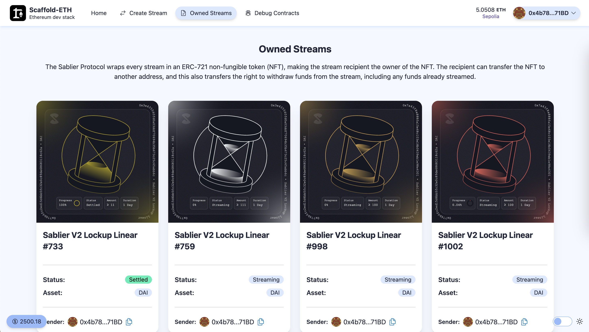

# Sablier Extension for Scaffold-ETH 2

<h4 align="center">
  <a href="https://scaffold-sablier-template-nextjs.vercel.app/">Template demo</a>
</h4>

This extension integrates Sablier, a decentralized money streaming protocol, with the Scaffold-ETH 2 stack. It provides a starting point for developers to build applications with streaming payments functionality on Ethereum.


## What is Sablier?

**[Sablier](https://sablier.com)** is a protocol for real-time finance on Ethereum. It allows for the creation of token streams, enabling continuous, gradual payments over time. This can be used for various applications such as salaries, subscriptions, vesting schedules, and more.

## NFTs

The Sablier Protocol wraps every stream in an ERC-721 non-fungible token (NFT), making the stream recipient the owner of the NFT. The recipient can transfer the NFT to another address, and this also transfers the right to withdraw funds from the stream, including any funds already streamed.



## Features

- Integration of Sablier smart contracts with Scaffold-ETH 2
- Example components for creating and fetching token streams
- Custom hooks for interacting with Sablier protocol
- Demonstration of linear and dynamic streaming options

## Getting Started

   ```bash
   npx create-eth@latest -e fac3m4n/scaffold-sablier-extension
   ```

## Usage

This extension provides example components and hooks for interacting with the Sablier protocol:

- `LinearStreamForm`: Component for creating linear token streams
- `DynamicStreamForm`: Component for creating dynamic token streams
- `useScaffoldContractWrite`: Custom hook for writing to Sablier contracts
- `useScaffoldContractRead`: Custom hook for reading from Sablier contracts

Explore the `packages/nextjs/app/create-stream` directory for implementation details.

## Documentation

For more information on how to use and extend this template, refer to the following resources:

- [Scaffold-ETH 2 Documentation](https://docs.scaffoldeth.io/)
- [Sablier Documentation](https://docs.sablier.com/)

## Contributing

Contributions are welcome! Please feel free to submit a Pull Request.

## License

This project is licensed under the MIT License.
