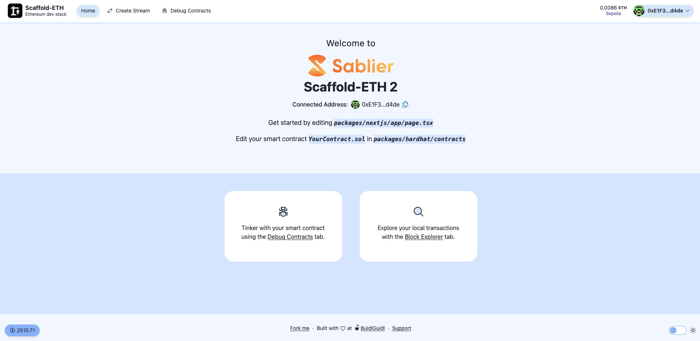
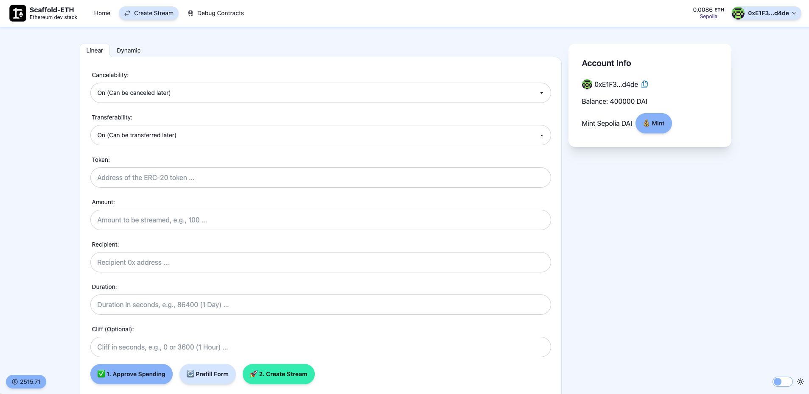

# Sablier Extension for Scaffold-ETH 2

This extension integrates Sablier, a decentralized money streaming protocol, with the Scaffold-ETH 2 development stack. It provides a starting point for developers to build applications with streaming payments functionality on Ethereum.




## What is Scaffold-ETH 2?

Scaffold-ETH 2 is an open-source toolkit for building decentralized applications (dApps) on Ethereum. It uses NextJS, RainbowKit, Wagmi, Viem, and TypeScript, supporting both Hardhat and Foundry. With features like live-updating frontends, pre-built components, custom hooks, and a built-in block explorer, it accelerates dApp development from prototype to production.

## What is Sablier?

Sablier is a protocol for real-time finance on Ethereum. It allows for the creation of token streams, enabling continuous, gradual payments over time. This can be used for various applications such as salaries, subscriptions, vesting schedules, and more.

## Features

- Integration of Sablier smart contracts with Scaffold-ETH 2 (currently support DAI on Sepolia)
- Example components for creating and managing token streams
- Custom hooks for interacting with Sablier protocol
- Demonstration of linear and dynamic streaming options

## Getting Started

   ```
   npx create-eth@latest -e fac3m4n/scaffold-sablier-extension
   ```

## Usage

This extension provides example components and hooks for interacting with the Sablier protocol:

- `LinearStreamForm`: Component for creating linear token streams
- `DynamicStreamForm`: Component for creating dynamic token streams
- `useScaffoldContractWrite`: Custom hook for writing to Sablier contracts
- `useScaffoldContractRead`: Custom hook for reading from Sablier contracts

Explore the `packages/nextjs/app/create-stream` directory for implementation details.

## Documentation

For more information on how to use and extend this template, refer to the following resources:

- [Scaffold-ETH 2 Documentation](https://docs.scaffoldeth.io/)
- [Sablier Documentation](https://docs.sablier.com/)

## Contributing

Contributions are welcome! Please feel free to submit a Pull Request.

## License

This project is licensed under the MIT License.
